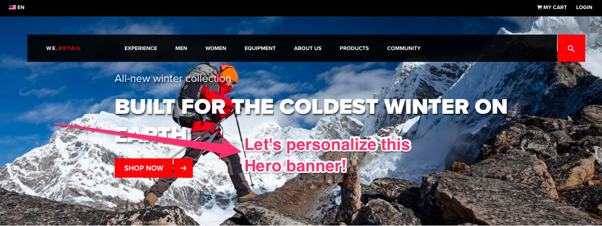
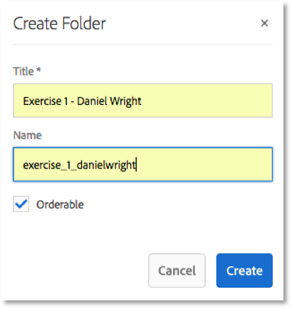
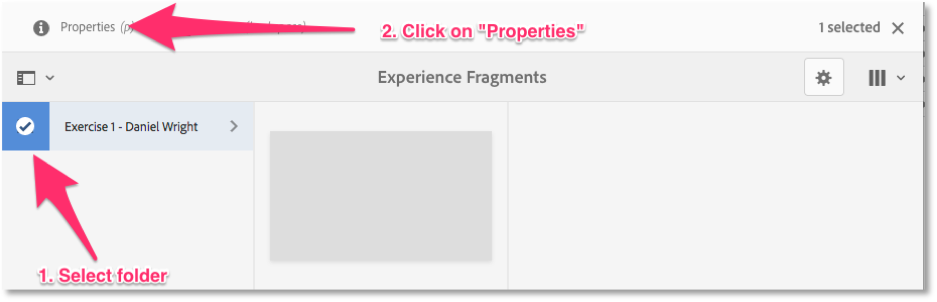
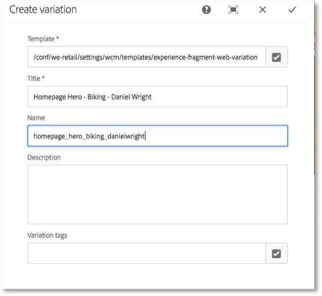
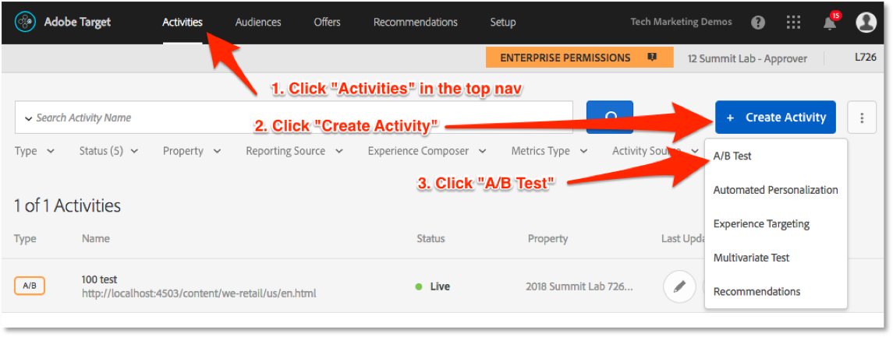
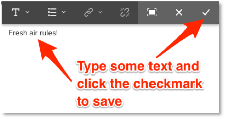
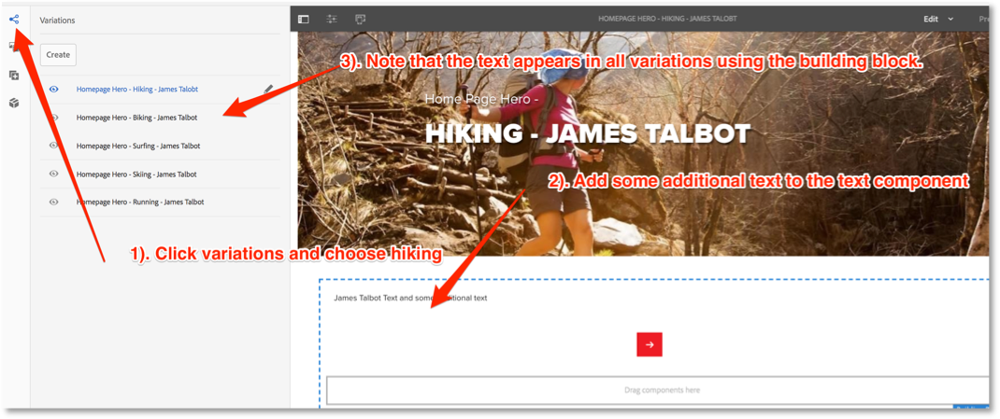

> Integrating Experience Fragments with Adobe Target
>
> L726
>
> ­Adobe Marketing Summit 2018

Table of Contents {#table-of-contents .TOCHeading}
=================

[Lab Overview 3](#lab-overview)

[Scope 3](#scope)

[Business Problem 3](#business-problem)

[Lesson 1: AEM - Build Experience Fragments in AEM
3](#lesson-1-aem---build-experience-fragments-in-aem)

[Definition 4](#definition)

[Objectives 4](#objectives)

[Step 1: Go to the Experience Fragment menu
4](#step-1-go-to-the-experience-fragment-menu)

[Step 2: Create a new Folder 5](#step-2-create-a-new-folder)

[Step 3: Examine and Add the Target cloud configuration
6](#step-3-examine-and-add-the-target-cloud-configuration)

[Step 4: Create Experience Fragments
9](#step-4-create-experience-fragments)

[Step 4: Author the Experience Fragment
11](#step-4-author-the-experience-fragment)

[Optional exercise---create Previews:
15](#optional-exercisecreate-previews)

[Step 4: Share the Experience Fragments
16](#step-4-share-the-experience-fragments)

[Lesson 2: Target -- Create an Auto-target activity using XFs
17](#lesson-2-target-create-an-auto-target-activity-using-xfs)

[Objectives 17](#objectives-1)

[Step 1: Log into the Experience Cloud
17](#step-1-log-into-the-experience-cloud)

[Step 2: Confirm your XFs have arrived in Target
18](#step-2-confirm-your-xfs-have-arrived-in-target)

[Step 3: Build an Auto-Target Activity using your XFs
19](#step-3-build-an-auto-target-activity-using-your-xfs)

[Step 4: Validate your activity 27](#step-4-validate-your-activity)

[Lesson 3: AEM - Build a more advanced Experience Fragment with building
blocks and components
28](#lesson-3-aem---build-a-more-advanced-experience-fragment-with-building-blocks-and-components)

[Scenario 28](#scenario)

[Objectives 28](#objectives-2)

[Step 1: Create a Building Block in our Experience Fragment master
variation
28](#step-1-create-a-building-block-in-our-experience-fragment-master-variation)

[Step 2: Use the Building Block in our variations
30](#step-2-use-the-building-block-in-our-variations)

[Exercise 4 (Optional): Convert existing Page content into XFs
33](#exercise-4-optional-convert-existing-page-content-into-xfs)

Lab Overview 
=============

Scope 
------

In this Lab, you will learn how to use the new integration between Adobe
Experience Manager (AEM) and Adobe Target using Experience Fragments.
This powerful integration allows content authors in AEM to create
content in the form of Experience Fragments, which can then be sent to
Target where optimization experts can use them for testing and
personalization.

You will learn:

1.  How to create new Experience Fragments

2.  How to take existing content and convert them into Experience
    Fragments

3.  How to share Experience Fragments to Target

4.  How to leverage Experience Fragments in Target

Business Problem
----------------

You are the manager of the retail website, We.Retail
(<http://localhost:4503/content/we-retail/us/en.html>). You sell
equipment and clothing for outdoor activities---running, hiking, skiing,
biking, and surfing. Instead of serving the same homepage hero banner to
all customers (currently featuring your new winter collection) you would
like to see if you can get better conversion rates by personalizing the
homepage hero based on the visitor's favorite activity. What is the most
efficient way to create and personalize content using AEM and Target?
How can you serve the right content to the right visitor at the right
time?

{width="7.798611111111111in"
height="2.9340277777777777in"}

 Lesson 1: AEM - Build Experience Fragments in AEM
==================================================

 Definition
-----------

An Experience Fragment (XF) allows authors to manage a set of associated
content that can be published/consumed via different channels.
Variations of the content can be created for different devices (mobile,
desktop, tablet, Apple Watch, Alexa), different context (Pinterest,
Facebook) or different languages.

Objectives
----------

1.  Create a simple Experience Fragment in AEM

2.  Add the Target Cloud configuration

3.  Create a Target offer

Step 1: Go to the Experience Fragment menu
------------------------------------------

Open <http://localhost:4502> in your browser to access the AEM menu. If
you open AEM for the first time, you have to enter username and
password.

Username: admin\
Password: admin\
{width="5.77215113735783in"
height="2.412055993000875in"}

Using AEM's navigation menu, navigate to **Experience
Fragments**{width="5.7614271653543305in"
height="2.291139545056868in"}

Step 2: Create a new Folder
---------------------------

There are no Experience Fragments (XF) or folders by default. We
recommend using Folders to organize XFs. You can also attach
configurations, such as the Adobe Target configuration, to them.

{width="7.797174103237095in"
height="1.9367093175853018in"}

Create a folder as follows:

1.  Title: Exercise 1- YOUR NAME

2.  Name: exercise\_1\_YOURNAME

Title is what the author will see in the UI, while Name is used to
create the path to the folder in the JCR. Orderable sets up the folder
for organization, so you can do things like sort columns.\
{width="2.6442300962379703in"
height="2.7869346019247594in"}

Step 3: Examine and Add the Target cloud configuration
------------------------------------------------------

The Adobe Target Cloud Service needs to be configured and applied to the
experience fragments so you can share them with Target. The Service is
pre-configured in the Lab machines, but we will examine the settings so
you are familiar with them:\
{width="7.798611111111111in"
height="3.8368055555555554in"}\
{width="7.798611111111111in"
height="3.9254155730533684in"}

Click "Edit" to open the configuration:\
{width="2.240384951881015in"
height="1.1161767279090113in"}

The configuration should look like this:\
{width="3.8669892825896763in"
height="4.913461286089239in"}

Enter the password "022010Adobe" and click "Re-Connect to Adobe Target"
to confirm that the configuration is set up correctly. You should get a
"Connection successful" message:\
{width="1.6923075240594925in"
height="0.8924606299212599in"}

If you want to share an XF to Target, you have add the Target
configuration at either the folder or XF level. An XF without a
configuration tries to inherit the configuration from its enclosing
folder.

Open the folder you created in Step 2 (return to
<http://localhost:4502/> and click on XFs) and add the Target
config:{width="6.152571084864392in"
height="1.9134612860892388in"}\
{width="6.057691382327209in"
height="3.0498829833770777in"}
{width="7.74050634295713in"
height="3.288462379702537in"}

Step 4: Create Experience Fragments
-----------------------------------

For this exercise we are going to create simple Experience Fragments
that consist of only one hero image component. (Quick reminder: An
Experience Fragment is an experience with at least one component and a
layout.)

An Experience Fragment can have multiple variations (e.g. optimized for
different channels, grouping different experiences in one Experience
Fragment). A variation is based on a template (Like a page template). We
will create variations for each type of activity for which We.Retail
sells equipment---hiking, running, surfing, skiing, and
biking.{width="7.798611111111111in"
height="2.0034722222222223in"}

This will start the wizard to create the first variation. Every
Experience Fragment has one master
variation.{width="7.798611111111111in"
height="2.955696631671041in"}

The template defines structure, default content and what components can
be used. Give the XF a unique name and title that includes YOUR NUMBER
or YOURNAME. The master variation will automatically receive the same
title. This title is what will appear in Adobe Target. (Descriptions and
Tags are not passed to Target, so we will not use
them).{width="7.798611111111111in"
height="3.963888888888889in"}

Once you click 'Create', your Experience Fragment will be created and is
now ready to get authored. Click 'Open' to open the edit mode.\
{width="2.7974682852143484in"
height="1.4031463254593175in"}

Step 4: Author the Experience Fragment
--------------------------------------

1.  Select the "Hero Image"
    component:{width="7.798611111111111in"
    height="3.298611111111111in"}

2.  Now we want to add an image, some copy and a call-to-action (CTA).
    If a visitor clicks on the CTA, he should get re-directed to a page
    that provides more information. Configure the component:
    {width="6.596153762029746in"
    height="3.796165791776028in"}

3.  Add the hero
    image:{width="6.788996062992126in"
    height="3.745736001749781in"}

4.  Add copy and a link to the hero:\
    {width="4.2307688101487315in"
    height="3.9847583114610674in"}

    Here is the path for the link:\
    {width="7.538462379702537in"
    height="3.1993153980752407in"}

5.  The end result should look like this:\
    {width="7.106387795275591in"
    height="3.2307699037620297in"}

Now add Variations for the other types of equipment:\
{width="4.163462379702537in"
height="1.9867136920384951in"}

Repeat steps 1-5 above to create additional Hero Image components with
custom imagery, text, and links for biking, running, skiing (use "Snow
Sports" for the link), and surfing:\
{width="3.471153762029746in"
height="3.197620297462817in"}{width="3.7413418635170603in"
height="3.6933759842519684in"}

### Optional exercise---create Previews:

{width="7.798611111111111in"
height="2.7944444444444443in"}

{width="7.798611111111111in"
height="4.898611111111111in"}

Repeat for the other variations. Unfortunately, the images don't appear
in these Previews because in the Hero Image component they are
background images.

Step 4: Share the Experience Fragments
--------------------------------------

Every Experience Fragments needs to be published / activated in order to
work properly with Target. There is a top-menu button 'Publish' to
activate the Experience Fragment. Publish means it is publicly
accessible. The export action verifies if the Experience Fragment is
activated, if not it will remind you first.

1.  Switch to the browser tab with Experience Fragments open

2.  Select the master variation in the Exercise 1 folder and export it
    to Target:

    {width="6.182692475940508in"
    height="2.574378827646544in"}

3.  In the dialog, click "Publish":\
    {width="3.0in" height="1.1907720909886264in"}

4.  You will get a confirmation when the XF is exported:\
    {width="2.538462379702537in"
    height="1.2652023184601924in"}

Lesson 2: Target -- Create an Auto-target activity using XFs
============================================================

Objectives
----------

Adobe Target is the "decision engine" of the Experience Cloud. Target
Premium has powerful machine-learning capabilities and a friendly user
interface that allows marketers to quickly create experiences that will
be automatically matched to visitors based on their individual profile.
In this exercise, we will use the Experience Fragments created earlier
to build an Auto-target activity.

[Auto-target](https://marketing.adobe.com/resources/help/en_US/target/target/c_auto-target-to-optimize.html)
activities are built just like A/B tests, but with the check of a box,
Adobe Sensei will start building models to predict which experience to
serve to the visitors based on their individual profiles and historical
data collected in the activity. Experiences will be served randomly at
first, but over time Target will start delivering the optimal experience
to each visitor to maximize your key metric.

Step 1: Log into the Experience Cloud
-------------------------------------

1.  In a new tab (preferably Chrome), open the Experience Cloud login
    page: <https://marketing.adobe.com>

2.  Click "Sign in with an Adobe ID"\
    {width="1.951923665791776in"
    height="2.106583552055993in"}

3.  Sign in using the following credentials:

    a.  Username: <dwright+YOURNUMBER@adobetest.com>

    b.  Password: Password1\$

4.  If prompted to add a mobile phone number or go through some intro
    tutorial, click "Skip"

5.  Click "Launch" on the Target card\
    {width="4.221154855643045in"
    height="1.7301837270341207in"}

6.  You will land on the Activities list page where you should verify
    the following. **Get a TA's attention if you can't verify these:\
    **{width="7.26923009623797in"
    height="2.841666666666667in"}

Step 2: Confirm your XFs have arrived in Target
-----------------------------------------------

It can currently take up to ten minutes for Experience Fragments to be
sent from AEM to Target. Let's confirm that ours have arrived. Note that
all XFs are currently sent to the "Default Workspace" in Target:\
{width="7.798611111111111in"
height="3.259027777777778in"}

Step 3: Build an Auto-Target Activity using your XFs
----------------------------------------------------

1.  Return to the Activities page and click the blue button to create an
    A/B test activity:{width="7.538996062992126in"
    height="2.796075021872266in"}

2.  Leave all of the default settings for the activity and click
    "Next":\
    {width="5.540069991251094in"
    height="4.211538713910761in"}

3.  In order to load the site from localhost we need to use the
    non-enhanced Visual Experience Composer (VEC) in Target. Since the
    non-enhanced VEC uses an iframe to load the homepage, and since
    localhost uses http while the Target UI is https, we need to allow
    mixed content by taking this step. **If you are using Chrome,**
    follow the instructions to allow "Load unsafe scripts." and reload
    the page:{width="7.471154855643045in"
    height="1.4762685914260718in"}In the dialog, click "Reload":\
    {width="4.013560804899387in"
    height="1.4038462379702537in"}\
    **If you are using Firefox,** you essentially do the same thing, but
    the options are to the left of the address bar:\
    {width="3.451010498687664in"
    height="1.5362707786526684in"}{width="2.4325656167979in"
    height="2.6610575240594927in"}

4.  The homepage should now load in the Visual Experience Composer
    (VEC). **If not, get a TA's attention.**

5.  This Target account uses the Enterprise Permissions feature to
    restrict users to different "properties". We need to take a quick
    detour to associate this activity with the correct property. Follow
    the steps in the next four screenshots to add the "2018 Summit Lab
    726-AEM XF to Target integration" property:\
    {width="4.259616141732283in"
    height="2.2049103237095364in"}\
    {width="3.336777121609799in"
    height="1.9038462379702537in"}{width="5.826923665791776in"
    height="2.0490223097112863in"}\
    {width="5.826388888888889in"
    height="1.7577734033245844in"}

6.  Rename the activity

7.  Select the container element that spans the full width of the hero,
    and then click "Expand Selection" in the menu to move up one
    container in the hierarchy:\
    {width="7.614573490813648in"
    height="4.307692475940508in"}

8.  Now click "Swap with Experience Fragment" in the VEC menu:\
    {width="7.593105861767279in"
    height="3.221153762029746in"}

9.  This will open the XF screen that we looked at earlier. Click to
    select one of your XFs and then click "Done":\
    {width="6.8960892388451445in"
    height="3.4326924759405073in"}

10. You will now see your XF preview in the VEC. Rename the experience
    to match your creative and then click to "Add Experience" (you can
    close the dialog about "Manually edited JavaScript":\
    {width="7.396199693788277in"
    height="3.817308617672791in"}

11. Repeat the steps 7-10 above to create experiences for each one of
    your XFs and then click "Next":\
    {width="7.067307524059492in"
    height="3.533653762029746in"}

12. Because we have 100 users creating an activity on the same page, we
    are going to use a trick so that you can target your test to
    yourself. Click the vertical dots icon and select "Replace
    Audience":{width="3.942308617672791in"
    height="2.8911154855643044in"}

13. Filter the audience list to select the Lab User \# audience that
    matches your participant number:\
    {width="6.259616141732283in"
    height="2.755622265966754in"}

14. Select Auto-target as the traffic allocation method and click
    "Next":\
    {width="7.404166666666667in"
    height="3.771311242344707in"}

15. Configure the Optimization goal and then click "Save & Close":\
    {width="7.433011811023622in"
    height="3.915734908136483in"}

16. Your activity will save and sync. Finally activate the activity:\
    {width="7.490383858267717in"
    height="3.1782436570428696in"}

Step 4: Validate your activity
------------------------------

1.  Open up your publish URL with a parameter at the end
    <http://localhost:4503/content/we-retail/us/en.html?labuser=YOURNUMBER>
    to qualify you for your unique "Lab User" audience

2.  Until the models of an Auto-target activity are built, visitors will
    be randomly assigned to one of the experiences, including the
    default experience. If you don't immediately recognize the
    experience as coming from your activity (a fifth of you will get the
    default experience), you can use the Developer Tools (right-click on
    the page and click "Inspect") and use the Network tab to view the
    response tokens in Target's mbox response. If you are see the name
    of your activity in the tokens, you are in the activity! You can
    also load the URL in a Private Browser window in order to qualify
    for a different experience:\
    {width="7.317307524059492in"
    height="5.786733377077865in"}

> **Congratulations, you are using Adobe Sensei to deliver targeted
> content using AEM and Target!**

Lesson 3: AEM - Build a more advanced Experience Fragment with building blocks and components
=============================================================================================

Scenario
--------

A building block is essentially an experience fragment that can only be
used by other experience fragments. It creates a set of associated
components, with the content, for use across multiple variations.
Authors can maintain content in one variation, and have that content be
applied across variations automatically. The best practice is to set up
the building block in the master variation and consume that building
block in other variations.

Objectives
----------

1.  Create building blocks in an experience fragment

2.  Learn how building blocks can be useful in variations

Step 1: Create a Building Block in our Experience Fragment master variation
---------------------------------------------------------------------------

First we must return to AEM and create a building block:

1.  Open up a browser tab to the AEM Author instance
    (<http://localhost:4502/>)

2.  Navigate to Experience Fragments

3.  Open your folder and edit the master variation (probably hiking)

4.  Add a Link Button and a Text component to the master
    variation:{width="6.932691382327209in"
    height="4.218262248468942in"}

<!-- -->

1.  Add some text to the text component:\
    {width="7.259616141732283in"
    height="0.9305555555555556in"}\
    {width="2.8846161417322835in"
    height="1.4824737532808399in"}

2.  Now select the text component again and click the group icon:\
    {width="6.288462379702537in"
    height="1.45875in"}

3.  Select the text component and the linkbar component (you will see
    the components outlined in blue) and then click the building block
    icon to create a reusable building block:\
    {width="6.365384951881015in"
    height="1.7431178915135608in"}

4.  Give your building block a name e.g. James Talbot -- Text and Link\
    {width="2.0673075240594927in"
    height="1.3763856080489938in"}

Step 2: Use the Building Block in our variations
------------------------------------------------

We now want to build variations following the building block best
practices.

1.  Select the variations drawer on the sidebar. Select the Biking
    variation:{width="4.655061242344707in"
    height="3.775in"}

2.  Select the building block icon\
    {width="4.020513998250219in"
    height="3.2527777777777778in"}

3.  Drag the text and link building block you created earlier below the
    hero image:\
    {width="6.952826990376203in"
    height="3.153846237970254in"}

4.  Repeat these steps for the surfing, skiing and running variations

5.  Return to the original hiking variation and add some additional text
    (if you don't see the pencil icon, try ungrouping the text component
    first):{width="7.038461286089239in"
    height="2.89623687664042in"}

6.  Update the experience fragments in Adobe Target and publish:\
    {width="7.221688538932633in"
    height="3.480300743657043in"}

7.  Reload the page where you have entered the activity (http://
    <http://localhost:4503/content/we-retail/us/en.html?labuser=YOURNUMBER>)

Exercise 4 (Optional): Convert existing Page content into XFs
=============================================================

You don't even have to start from scratch to create Experience
Fragments. You can take existing content from your AEM site and convert
it into an Experience Fragment. For example, say you are an optimization
expert and Target user. Perhaps bandwidth for creating new content is
low and you have always wanted test some existing content on a different
page, you---or your AEM counterpart---can convert that content into an
experience fragment with minimal effort. Here's how:

1.  Open AEM Sites:\
    {width="6.837073490813649in"
    height="3.0842935258092736in"}

2.  Open the US English homepage in editing
    mode:{width="7.298611111111111in"
    height="3.020832239720035in"}

3.  Pick an existing piece of content and convert it into an Experience
    Fragment:\
    {width="4.875in" height="4.962837926509186in"}
